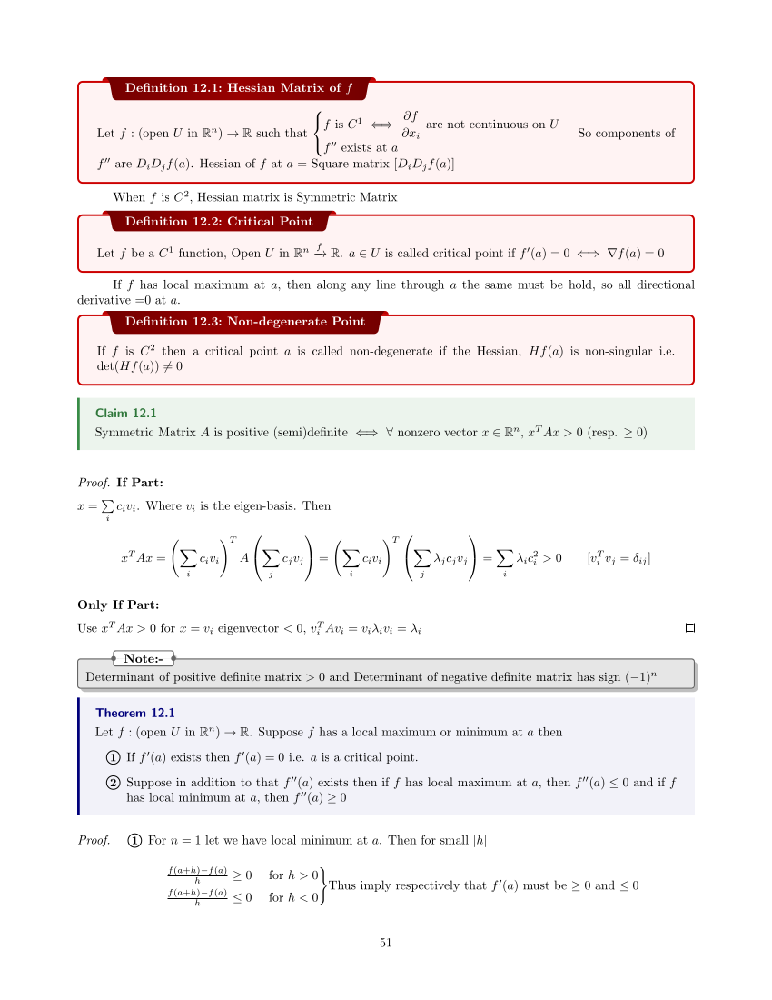
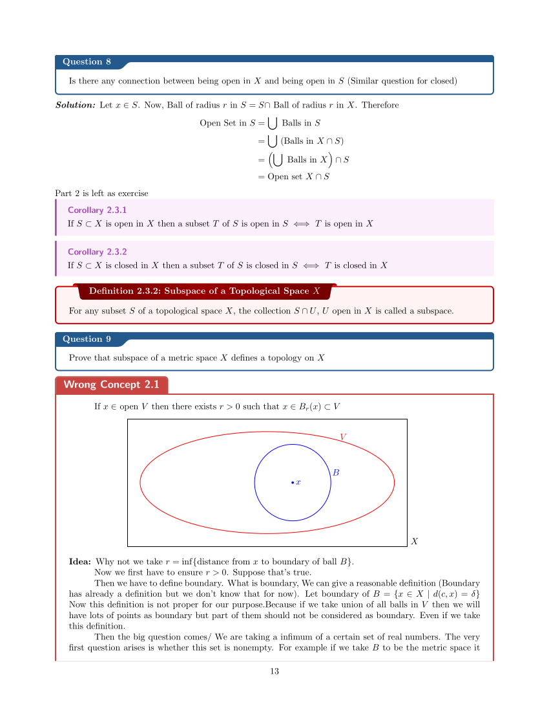
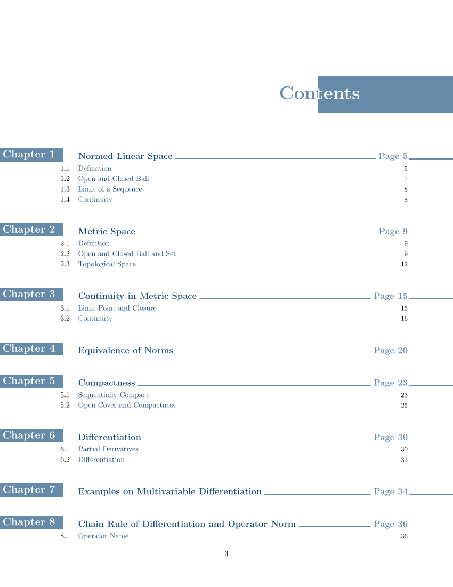

# Eye-Candy-Lecture-Notes-Theme
This is a Eye Candy lecture note taking theme I have created for my personal course lecture notes. If you want to check an actual example in using this theme. Then you can check my [Analysis Lecture Notes](analysis_class-note.pdf). If you want to just view some pages of using this theme. Here check these pages





## Theorem Boxes
I have many theorem boxes for Theorems, Corollaries, Lemmas, Claims, Definitions, Examples, Questions etc.

 

The environments which are appears in pairs one of them is for the chapters which have sections whose environment name starts with small letter and the other is for chapters which do not have sections whose environment name starts with capital letter. In the short command for the latter I used the letter 'c' to represent it should be use if it is not under a section

Short commands for environments goes like this
```tex
\commandName[reference_name]{heading}{description}
```
For example in theorem for suppose Fundamental Theorem of Calculus i will write like this
```tex
\thm[ftc]{Fundamental Theorem of Calculus}{Theorem Statement}
```

## Proof
The proof environment actually multipurpose. For a proof many things actually play. Proof idea. Proof overview. Main pproof. Proof prerequisites etc. Thats why the first option uses the actual name of what exactly we are writing for the proof. It will go like this
Proof idea: `\pf{Proof Idea}{content..}`
Proof Overview: `\pf{Proof Overview}{content..}`
Proof : `\pf{Proof}{content..}`

>Thereom boxes, Proof environment and contents page are set up in the file [preamble](preamble.tex)

## Contents Page
I have a beautiful looking contents page. 



>I woulld suggest dont play with the margin. It kind of ruins the contents page.


## Macros
I have two macros file. One is for different fonts and the hats, bars, tildes. These are in [letterfonts](letterfonts.tex) file. 
```tex
Blackboard Font:              \newcommand{\bbA}{\mathbb{A}}
Bold Math:                    \newcommand{\bmA}{\boldsymbol{A}}
Math SCR Font:                \newcommand{\sA}{{\mathscr{A}}}
Math Fraktur Font:            \newcommand{\mfA}{\mathfrak{A}}


Bar:                          \newcommand{\ovA}{\overline{A}}
Tilde:                        \newcommand{\tdA}{\tilde{A}}
Vector:                       \newcommand{\vA}{\vec{A}}


Greek Letters:
\newcommand{\al}{\alpha}		  \newcommand{\Al}{\Alpha}
\newcommand{\gm}{\gamma}		  \newcommand{\Gm}{\Gamma}
\newcommand{\dl}{\delta}		  \newcommand{\Dl}{\Delta}
\newcommand{\eps}{\epsilon}		\newcommand{\Eps}{\Epsilon}    \newcommand{\veps}{\varepsilon}
\newcommand{\lm}{\lambda}		  \newcommand{\Lm}{\Lambda}
\newcommand{\sg}{\sigma}		  \newcommand{\Sg}{\Sigma}

\newcommand{\vph}{\varphi}
\newcommand{\om}{\omega}		  \newcommand{\Om}{\Omega}
```

There are some other macros which are my lecture notes specific and daily workflow specific. These are in the file [macros](macros.tex).
